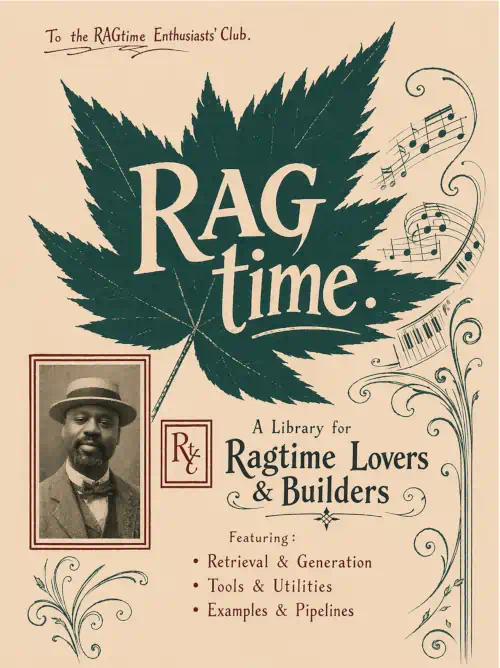

<p align="center">
  
</p>

# RAGtime

RAGtime is a lightweight Retrieval-Augmented Generation (RAG) framework for Node/Bun. It handles the full pipeline from ingestion to answer generation — chunking, embedding, storage, retrieval, and conversational response — through a clean plugin architecture.

LLM providers and vector stores are swappable interfaces. OpenAI, Anthropic, and Google Gemini ship out of the box. Any custom provider or vector store can be added without touching library internals.

## Features

- High-level plugin API — one call to ingest, one call to query
- Built-in conversational history with automatic compaction
- Provider abstraction — OpenAI, Anthropic, and Gemini supported
- Vector store abstraction — Qdrant built-in, custom backends easy to add
- Embed PDFs and raw text
- Query single or multiple collections
- Typed error classes for fast, visible failures
- Full unit test coverage

## Requirements

- Bun runtime
- Docker + Docker Compose (for Qdrant)
- An API key for your chosen LLM provider

## Getting Started

```bash
bun install
```

Start Qdrant and run all tests:

```bash
bun run setup
```

Create a `.env` file in your project root:

```
OPENAI_API_KEY=your-key-here
```

---

## Quick Start — Plugin API

The recommended way to use RAGtime is through a plugin. Two are included:

| Plugin | Description |
|---|---|
| `ConversationalRag` | General-purpose conversational RAG with history |
| `DocumentRag` | Document Q&A with numbered source citations |

### Conversational RAG

```ts
import { ConversationalRag, QdrantVectorStore } from 'rag-time'
import { OpenAIProvider } from 'rag-time/providers/openai'

const provider = new OpenAIProvider({ apiKey: process.env.OPENAI_API_KEY! })

const rag = new ConversationalRag({
  chatProvider:      provider,
  embeddingProvider: provider,
  vectorStore:       new QdrantVectorStore(),
})

// Ingest your content once
await rag.ingest('The Battle of Hastings took place in 1066. William the Conqueror defeated Harold.')

// Ask questions — returns answer, sources, and updated history
const response = await rag.query('Who won the Battle of Hastings?')
console.log(response.answer)   // "William the Conqueror defeated Harold..."
console.log(response.sources)  // [{ id: 42, score: 0.93, text: '...', metadata: { index: 3 } }]

// Pass history back for multi-turn conversation
const followUp = await rag.query('What year was that?', response.history)
console.log(followUp.answer)   // "...1066..."
```

### Document Q&A with source citations

```ts
import { readFileSync } from 'fs'
import { DocumentRag, QdrantVectorStore } from 'rag-time'
import { OpenAIProvider } from 'rag-time/providers/openai'

const provider = new OpenAIProvider({ apiKey: process.env.OPENAI_API_KEY! })

const rag = new DocumentRag({
  chatProvider:      provider,
  embeddingProvider: provider,
  vectorStore:       new QdrantVectorStore(),
})

const pdfBuffer = readFileSync('path/to/document.pdf')
await rag.ingest(pdfBuffer)

const response = await rag.query('What are the key terms in section 3?')
// Answer will reference sources like: "According to [1] and [2]..."
console.log(response.answer)
```

---

## Mixing Providers

Anthropic does not offer an embeddings API, so pair it with OpenAI or Gemini for embeddings:

```ts
import { ConversationalRag, QdrantVectorStore } from 'rag-time'
import { AnthropicProvider } from 'rag-time/providers/anthropic'
import { OpenAIProvider } from 'rag-time/providers/openai'

const rag = new ConversationalRag({
  chatProvider:      new AnthropicProvider({ apiKey: process.env.ANTHROPIC_API_KEY! }),
  embeddingProvider: new OpenAIProvider({ apiKey: process.env.OPENAI_API_KEY! }),
  vectorStore:       new QdrantVectorStore(),
})
```

Gemini handles both chat and embeddings on its own:

```ts
import { ConversationalRag, QdrantVectorStore } from 'rag-time'
import { GeminiProvider } from 'rag-time/providers/gemini'

const provider = new GeminiProvider({ apiKey: process.env.GEMINI_API_KEY! })

const rag = new ConversationalRag({
  chatProvider:      provider,
  embeddingProvider: provider,
  vectorStore:       new QdrantVectorStore(),
})
```

Install optional provider packages when needed:

```bash
bun add @anthropic-ai/sdk        # for AnthropicProvider
bun add @google/generative-ai    # for GeminiProvider
```

Provider imports are exposed via subpaths:

```ts
import { OpenAIProvider } from 'rag-time/providers/openai'
import { AnthropicProvider } from 'rag-time/providers/anthropic'
import { GeminiProvider } from 'rag-time/providers/gemini'
```

---

## Configuration

Pass a `RagConfig` object when constructing any plugin:

```ts
const rag = new ConversationalRag({
  chatProvider:      provider,
  embeddingProvider: provider,

  // Use a custom Qdrant URL instead of localhost:6333
  qdrant: { url: 'http://qdrant.internal:6333' },

  // Or inject any VectorStore implementation directly
  vectorStore: new QdrantVectorStore({ url: 'http://qdrant.internal:6333' }),

  retrieval: {
    limit:          10,  // chunks returned to the LLM context (default: 5)
    candidateLimit: 30,  // pool size before deduplication (default: 20)
  },

  // Optional reranker stage after retrieval and before truncation
  reranker,

  tokenBudget: 12000,  // total token cap for assembled prompt (default: 8000)
})
```

Model selection belongs to the provider, not the config:

```ts
import { AnthropicProvider } from 'rag-time/providers/anthropic'
import { GeminiProvider } from 'rag-time/providers/gemini'
import { OpenAIProvider } from 'rag-time/providers/openai'
import type { Reranker } from 'rag-time'

const provider = new OpenAIProvider({
  apiKey:         process.env.OPENAI_API_KEY!,
  chatModel:      'gpt-4o-mini',              // default: 'gpt-4o'
  embeddingModel: 'text-embedding-3-small',   // default: 'text-embedding-ada-002'
})

const anthropic = new AnthropicProvider({
  apiKey: process.env.ANTHROPIC_API_KEY!,
  model:  'claude-haiku-4-5-20251001',        // default: 'claude-opus-4-6'
})

const gemini = new GeminiProvider({
  apiKey:         process.env.GEMINI_API_KEY!,
  chatModel:      'gemini-2.0-flash',         // default: 'gemini-1.5-pro'
  embeddingModel: 'text-embedding-005',       // default: 'text-embedding-004'
})

const reranker: Reranker = {
  rerank: async (_query, chunks) => chunks,
}
```

If you provide a `reranker`, it is applied after retrieval deduplication and before source truncation.

---

## Building a Custom Plugin

Extend `BaseRag` and override any hook. Everything else is inherited:

```ts
import { BaseRag, QdrantVectorStore } from 'rag-time'
import { AnthropicProvider } from 'rag-time/providers/anthropic'
import { OpenAIProvider } from 'rag-time/providers/openai'
import type { RetrievedChunk } from 'rag-time'

class LegalDocumentRag extends BaseRag {
  protected buildSystemPrompt(): string {
    return (
      'You are a legal document analyst. Answer questions based on the provided clauses. '
      + 'Always cite clause numbers and flag any limitations of liability explicitly.'
    )
  }

  protected presentContext(chunks: RetrievedChunk[]): string {
    return chunks
      .map((chunk, index) => `Clause [${index + 1}]:\n${chunk.text}`)
      .join('\n\n')
  }

  // ingest(), query(), token budget, history compaction — all inherited
}

const rag = new LegalDocumentRag({
  chatProvider:      new AnthropicProvider({ apiKey: process.env.ANTHROPIC_API_KEY! }),
  embeddingProvider: new OpenAIProvider({ apiKey: process.env.OPENAI_API_KEY! }),
  vectorStore:       new QdrantVectorStore(),
})
```

### Available hooks

| Hook | Default behaviour | When to override |
|---|---|---|
| `chunk(text)` | Calls `TextChunkerService` via the chat provider | Custom chunking logic (e.g. by clause, heading, paragraph) |
| `presentContext(chunks)` | Numbered list `[1] text...` | Custom context formatting |
| `buildSystemPrompt()` | Generic helpful-assistant instruction | Domain-specific LLM persona |
| `expandQuery(query)` | Returns `[query]` (single variant) | Multi-variant query expansion for better recall |

---

## Adding a Custom Vector Store

Implement three methods and pass the store via `RagConfig.vectorStore`:

```ts
import type {
  VectorStore,
  VectorPoint,
  VectorSearchResult,
  VectorStoreInsertResult,
} from 'rag-time'

class PineconeVectorStore implements VectorStore {
  constructor(private config: { apiKey: string; indexName: string }) {}

  async exists(collectionId: string): Promise<boolean> {
    // check whether the namespace exists in your Pinecone index
    return false
  }

  async insert(
    collectionId: string,
    points: VectorPoint[]
  ): Promise<VectorStoreInsertResult> {
    // upsert vectors into Pinecone namespace = collectionId
    return { collectionId, status: 'completed' }
  }

  async search(
    collectionId: string,
    queryVector: number[],
    limit: number
  ): Promise<VectorSearchResult[]> {
    // query Pinecone and map results to VectorSearchResult[]
    return []
  }
}

const rag = new ConversationalRag({
  chatProvider:      new OpenAIProvider({ apiKey: '...' }),
  embeddingProvider: new OpenAIProvider({ apiKey: '...' }),
  vectorStore:       new PineconeVectorStore({ apiKey: '...', indexName: 'my-index' }),
})
```

---

## Low-Level API

The underlying services are exported for callers who need direct access:

```ts
import {
  EmbeddingProcessingService,
  EmbeddingManagementService,
  EmbeddingQueryService,
  TextChunkerService,
  QdrantVectorStore,
} from 'rag-time'
import { OpenAIProvider } from 'rag-time/providers/openai'

const provider  = new OpenAIProvider({ apiKey: process.env.OPENAI_API_KEY! })
const store     = new QdrantVectorStore()
const mgmt      = new EmbeddingManagementService(store)
const chunker   = new TextChunkerService(provider)
const processor = new EmbeddingProcessingService(provider, mgmt)
const query     = new EmbeddingQueryService(mgmt, processor)

// Embed text — pass a chunkFn to handle chunking
const { embeddingId } = await processor.embedText('My content...', {
  chunkFn:  (text) => chunker.chunk(text),
  metadata: { source: 'manual-entry' },
})

// Embed a PDF file
const { embeddingId: pdfId } = await processor.embedPDF('path/to/file.pdf', {
  chunkFn: (text) => chunker.chunk(text),
})

// Query a collection
const results = await query.query('What year did I get the Amiga 500?', embeddingId!)

// Query multiple collections
const combined = await query.queryCollections(
  'What GPUs did I use and how is key exchange done?',
  [embeddingId!, pdfId!],
  2
)
```

---

## Tests

```bash
bun test spec
```

Unit tests cover every service, provider, store, and plugin with mocked dependencies. Integration tests run the full pipeline against a live Qdrant instance and require a valid `OPENAI_API_KEY`.

---

## License

MIT © Eugene Odeluga
